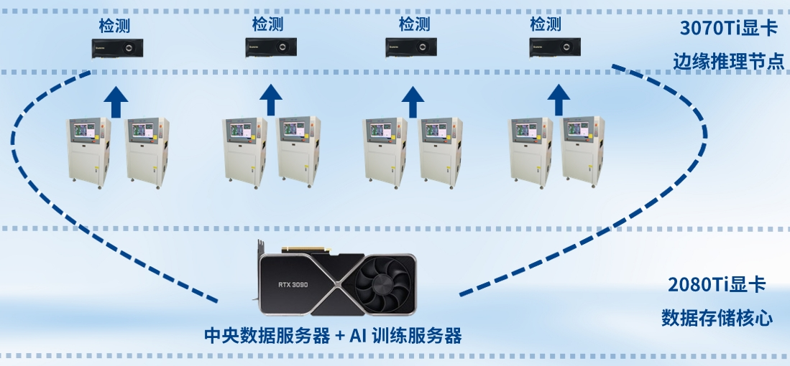
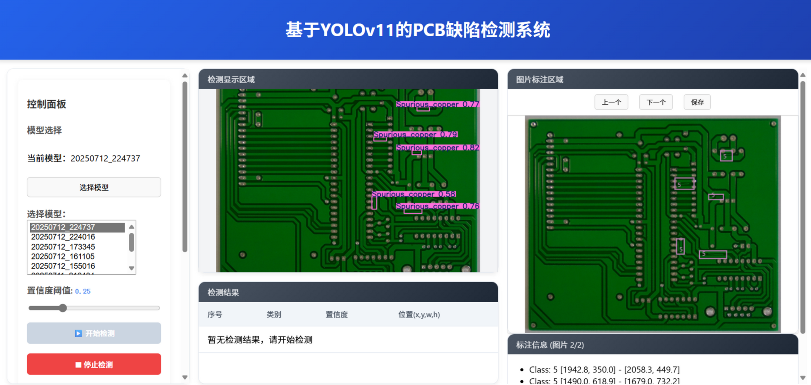

# PCB Detection

> A **hybrid active-learning based defect detection pipeline prototype** for industrial PCB AOI systems.  
> 🥇 Winner of the **Shokz Global Excellence and Innovative Talent Summer School 2025 Gold Award**.

[📽️ Demo Video (MP4)](docs/demonstration.mp4)

## 🧩 Introduction

This project addresses the high false-alarm rate in traditional AOI (Automatic Optical Inspection) systems used in PCB manufacturing.  
The proposed **AI-powered re-inspection system** integrates *active learning* and *improved YOLOv11* algorithms to intelligently verify suspected defects detected by AOI, significantly reducing manual workload and false alarms.

**Key goals:**
- Reduce AOI false alarm rate from ~28%, achieving a **miss rate below 0.07%** based on real PCB defect data from Huizhou Gaoshengda Technology Co., Ltd.
- Maintain real-time inspection speed of **666 FPS**
- Support **distributed inference + centralized training**
- Enable **continuous self-improvement** through human-in-the-loop feedback

## ⚙️ System Architecture

The system follows a *“Detection–Training–Annotation”* closed-loop design:

1. **Detection Frontend** – Receives AOI-captured images and performs real-time inference using a lightweight YOLOv11-based model.
2. **Training Backend** – Performs model retraining using uncertain or misclassified samples, employing the RAC2F feature-fusion module for improved micro-defect detection.
3. **Annotation Interface** – Provides a user-friendly web interface for rapid human verification and feedback. Corrections are fed back for continuous model improvement.

## 🏭 Industrial Applications

- **Mass Production QA** – Real-time, 24/7 defect detection matching SMT production speed.
- **Adaptive Model Updating** – Self-adjusts for multi-batch production without manual reconfiguration.
- **Low-Cost Deployment** – Runs on standard GPUs (RTX 3070Ti / 2080Ti), no hardware replacement required.
- **Educational Value** – Enables teaching and research in AI + Industrial Inspection.

<p align="center">
  
  <br/>
  <em>Figure: System deployment architecture of the distributed AI inspection solution.  
  Multiple AOI machines connect to edge inference nodes powered by RTX 3070Ti GPUs,  
  while a central server equipped with an RTX 2080Ti handles model training and data synchronization,  
  forming a "distributed inference + centralized training" closed-loop system.</em>
</p>

## 🧰 Tech Stack

- **Backend:** Python, PyTorch, YOLOv11, FastAPI  
- **Frontend:** Vue 3 + Vite + TypeScript  
- **Training:** Active Learning, RAC2F Feature Fusion, Distributed Training  
- **Hardware:** RTX 3070Ti (Edge Inference), RTX 2080Ti (Central Training)

## Environment Setup

This project is developed with **Python 3.10**. It is recommended to use **Conda** to create an isolated virtual environment.

### 1️⃣ Create and Activate a Conda Environment

```bash
conda create -n yolov11 python=3.10
conda activate yolov11
```

### 2️⃣ Install JupyterLab (Optional, for Interactive Development)

```bash
conda install jupyterlab
```

### 3️⃣ Install PyTorch + CUDA 11.8

Please choose the appropriate CUDA version according to your GPU driver.
Example for **CUDA 11.8**:

```bash
pip install torch==2.0.0+cu118 torchvision==0.15.1+cu118 --extra-index-url https://download.pytorch.org/whl/cu118
```

### 4️⃣ Install Project Dependencies

```bash
pip install requirements.txt
```
If any packages are missing, install them manually according to the error message: pip install <package_name>

---

## Dataset Directory Structure

The dataset is organized as follows, tailored for the **PCB defect detection** task:

```plaintext
./
├── backend_detect/                    # Backend: Detection service module (e.g., active learning, inference service)
│   ├── active_learning/               # Core logic for active learning
│   ├── datasets/simulate_ready_push/  # Directory for simulated datasets
│   ├── runs/active_learning/          # Logs and model checkpoints during active learning
│   ├── server.py                      # Entry point for detection service
│   └── pre.py                         # Data preprocessing script

├── backend_model/                     # Backend: Model training module (based on YOLO/Ultralytics)
│   ├── active_learning/               # Shared active learning module with backend_detect
│   ├── docker/                        # Docker deployment configurations
│   ├── docs/                          # Project documentation directory
│   ├── examples/                      # Example scripts and configuration files
│   ├── runs/active_learning/          # Training and inference output results
│   ├── tests/                         # Unit testing module
│   ├── ultralytics/                   # YOLO source code and customized components
│   ├── *.yaml                         # Dataset configuration files (e.g., BJ-PCB, GSD-PCB)
│   ├── detect.py                      # Inference script
│   ├── train.py / val.py / test.py    # Training, validation, and testing scripts
│   ├── server.py                      # Entry point for training service
│   └── image_labeler.py               # Image labeling logic (for interactive annotation)

├── frontend/                          # Frontend: Visualization interface built with Vue + TypeScript
│   ├── public/                        # Static assets directory
│   ├── src/                           # Frontend source code
│   │   ├── assets/                    # Image and media resources
│   │   ├── components/                # Core UI components (e.g., annotation area, results table)
│   │   │   ├── ControlPanel.vue
│   │   │   ├── DetectionArea.vue
│   │   │   ├── LabelArea.vue
│   │   │   ├── ResultTable.vue
│   │   │   └── TransfImg.vue
│   │   ├── stores/                    # State management modules (Pinia)
│   │   │   ├── manageImg.ts
│   │   │   └── manageModel.ts
│   │   └── main.ts / App.vue          # Project entry point
│   ├── package.json                   # Frontend dependency management
│   └── vite.config.ts                 # Build configuration (Vite)

├── requirements.txt                   # Python dependency list (backend environment)
├── README.md                          # Project documentation
```

### Notes

* `Dataset_Name/images/` and `Dataset_Name/labels/` are used for **training, validation**, and **testing**.
* `raw/Dataset_Name/Annotations/` contains the **original annotation files** (e.g., XML) for each defect category.
* `raw/Dataset_Name/labels/` stores the **converted YOLO-format labels** used for training.
* It is recommended to organize the raw data into the YOLO-required structure `images/` and `labels/` during the preprocessing stage.

### Example Annotation File

YOLO-format label file（`.txt`）：

```
<class_id> <x_center> <y_center> <width> <height>
```

All values are **normalized to the range [0, 1]**.

For dataset splitting and format conversion, you may refer to the provided `pre.py` script or write your own batch processing tool.

---

### 🧭 Usage Instructions

This project consists of **two backend modules** and **one frontend visualization interface**.
Follow the steps below to set up and run the system:

#### ✅ Install Dependencies

```bash
# Install backend dependencies
pip install -r requirements.txt

# Install frontend dependencies
cd frontend
npm install
```

#### 🚀 Launch Services

```bash
# Start Backend Service 1: Detection Service
cd backend_detect
python server.py

# Start Backend Service 2: Model Service
cd backend_model
python server.py

# Start Frontend Service (Vue + Vite)
cd frontend
npm run dev
```

<p align="center">
  
  <br/>
  <em>Figure: Frontend interface of the PCB defect detection system based on YOLOv11.  
  The left panel allows model selection and confidence threshold adjustment;  
  the middle panel visualizes real-time detection results;  
  the right panel supports manual annotation and feedback for active learning.</em>
</p>

#### ⚙️ Configure Service Endpoints (Optional)

The communication addresses among different modules are configured through `.env` files:

| PATH                    | Function Illustration                                        |
| --------------------- | ------------------------------------------- |
| `backend_detect/.env` | Defines the IP and port for frontend access to `backend\_detect`             |
| `backend_model/.env`  | Defines the address for `backend\_model` to access `backend\_detect`    |
| `frontend/.env`       | Defines the addresses for the frontend to access both backends |

Example configuration for `frontend/.env`：

```env
VITE_DETECT_API_URL=http://localhost:8000
VITE_MODEL_API_URL=http://localhost:8001
```

Adjust the IP and port numbers according to your actual runtime environment to ensure smooth communication among services.

---

## ⚠️ Notes

* If your GPU driver does not support CUDA 11.8, please visit the official PyTorch website
 to select a compatible version.
* The project supports Windows and Linux systems; Conda is recommended for Python environment management.
* If dependency conflicts or installation errors occur, try updating Conda first:

```bash
conda update -n base -c defaults conda
```


